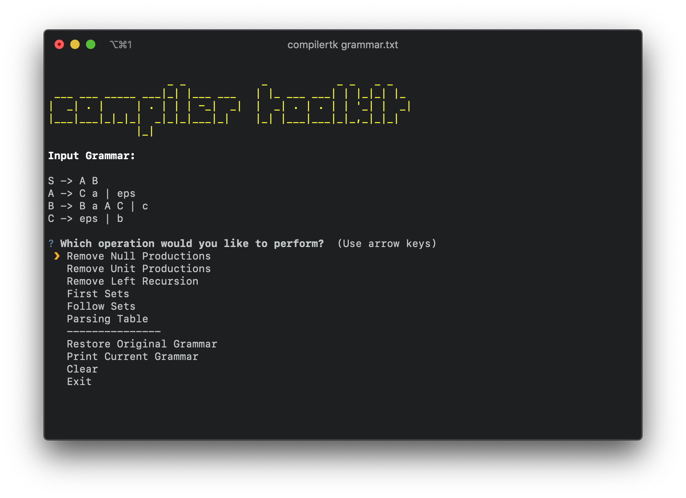

## compiler-toolkit
Collection of programs useful for syntax analysis.


---

  ```bash
  $ pip install compilertk
  $ compilertk FILE
  ```
---

Features:

  - Elimination of Null Productions
  - Elimination of Unit Productions
  - Elimination of Left Recursion
  - Calculates First Sets
  - Calculates Follow Sets
  - Prints Parsing Table
  - Generates a log file

## Notation

Using this example of a grammar:

```
S -> S a A | B
A -> a A | eps
B -> d E'
E' -> int a | eps
```

  - Every symbol on the left side is a non-terminal
  - Non-terminals and its productions are separated by "->"
  - Individual symbols are separated with a **space**.
  - Null productions are specified with **eps**
  - **|** is used to specify alternative productions

## Tests

Make sure everything runs fine by running the test cases

  1. `./run_tests.sh`

## TODOs

  - Add docstrings to functions
  - Add test cases for parsing table
  - Add more tests cases

## Useful Links

  - https://mikedevice.github.io/first-follow/
  - http://hackingoff.com/compilers
  - http://hackingoff.com/compilers/predict-first-follow-set (unreliable)
